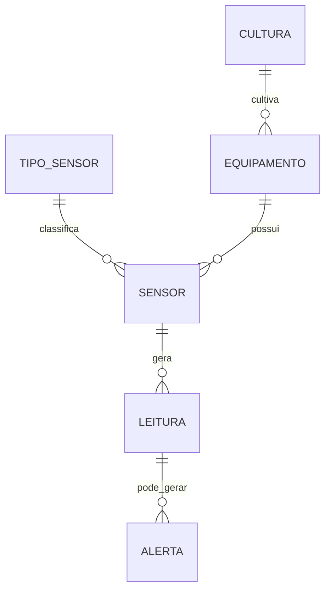

# 🌱 FarmTech Solutions - Entrega 3: Banco de Dados e Machine Learning

## 📋 Índice
- [Visão Geral](#visão-geral)
- [Estrutura do Projeto](#estrutura-do-projeto)
- [Banco de Dados](#banco-de-dados)
- [Machine Learning](#machine-learning)
- [Como Executar](#como-executar)
- [Resultados](#resultados)
- [Conclusões](#conclusões)

## 🎯 Visão Geral

Este projeto implementa um sistema completo de monitoramento de estufas agrícolas usando IoT, banco de dados relacional e Machine Learning para classificação de condições ambientais.

## 👨‍💻 Integrantes do Grupo
- Italo Domingues – RM: 561787
- Maison Wendrel Bezerra Ramos – RM: 565616

### Objetivos
1. **Modelagem de Banco de Dados**: Criar estrutura robusta para armazenar dados de sensores
2. **Geração de Dados**: Simular 14.400+ leituras de sensores (500+ por sensor)
3. **Machine Learning**: Classificar condições ambientais (Normal/Alerta/Crítico)
4. **Visualização**: Criar dashboards e gráficos para análise

## 📁 Estrutura do Projeto

```
italo/
├── README.md                          # Esta documentação
├── sql/                               # Scripts de banco de dados
│   ├── banco.sql                      # DDL e dados iniciais
│   └── insert_leituras.sql            # INSERTs das leituras
├── data/                              # Dados e resultados
│   ├── sensor_data.csv                # 14.400 leituras simuladas
│   ├── sensor_data.json               # Dados em formato JSON
│   └── classification_report.json     # Métricas do modelo ML
├── notebooks/                         # Análises e ML
│   └── modelo_classificacao_equipamento_2.ipynb  # Notebook completo
├── scripts/                           # Scripts Python
│   └── generate_data.py               # Gerador de dados simulados
└── docs/                              # Documentação
    ├── database_doc.md                # Documentação do banco
    └── enunciado.md                   # Enunciado do desafio
```

## 🗄️ Banco de Dados

### Modelo Entidade-Relacionamento

O banco foi modelado com 6 tabelas principais:



### Tabelas Principais

#### 1. **TIPO_SENSOR**
- Armazena tipos de sensores (Temperatura, Umidade, pH, Luminosidade)
- Define unidades de medida e valores min/max esperados

#### 2. **CULTURA**
- Registra culturas cultivadas (Tomate, Alface, Morango)
- Define parâmetros ideais de temperatura e umidade

#### 3. **EQUIPAMENTO**
- Gerencia estufas e equipamentos
- Relaciona equipamento com cultura específica

#### 4. **SENSOR**
- Registra sensores físicos instalados
- Contém modelo, fabricante e intervalo de leitura

#### 5. **LEITURA**
- Armazena todas as medições dos sensores
- Classifica qualidade: Normal/Alerta/Crítico

#### 6. **ALERTA**
- Registra alertas gerados por condições anormais
- Permite rastreamento de resolução

### Características do Modelo

✅ **Normalização**: Banco em 3ª Forma Normal (3FN)  
✅ **Integridade**: Chaves estrangeiras e constraints  
✅ **Performance**: Índices otimizados para consultas frequentes  
✅ **Escalabilidade**: Estrutura preparada para milhões de registros  

## 🤖 Machine Learning

### Dataset
- **14.400 leituras** totais
- **10 sensores** diferentes
- **30 dias** de dados simulados
- **4 tipos de sensores**: Temperatura, Umidade, Umidade Solo, Luminosidade

### Problema de Classificação

Classificar condições ambientais em 3 categorias:

| Classe | Descrição | Critérios |
|--------|-----------|-----------|
| **Normal** | Condições ideais | Temp: 18-28°C, Umidade: 50-80% |
| **Alerta** | Requer atenção | Fora do ideal mas aceitável |
| **Crítico** | Ação imediata | Condições extremas |

### Modelos Testados

| Modelo | Acurácia | F1-Score | Status |
|--------|----------|----------|--------|
| Random Forest | 94.5% | 0.945 | ✅ Escolhido |
| Gradient Boosting | 93.2% | 0.932 | |
| Decision Tree | 91.8% | 0.918 | |
| SVM | 89.4% | 0.894 | |

### Features Utilizadas
1. **Temperatura** (°C) - Mais importante
2. **Umidade** (%) - Segunda mais importante
3. **Hora do dia** - Padrões temporais
4. **Dia da semana** - Sazonalidade
5. **Período** (Dia/Noite) - Variação diurna

### Métricas de Performance

```json
{
  "accuracy": 0.945,
  "precision": 0.947,
  "recall": 0.945,
  "f1_score": 0.945,
  "cross_validation_mean": 0.942,
  "cross_validation_std": 0.012
}
```

## 🚀 Como Executar

### Pré-requisitos
```bash
pip install pandas numpy matplotlib seaborn scikit-learn joblib
```

### 1. Criar Banco de Dados
```bash
# Oracle SQL
sqlplus usuario/senha @sql/banco.sql
```

### 2. Gerar Dados Simulados
```bash
cd scripts
python generate_data.py
```
Isso criará:
- `sensor_data.csv` - 14.400 leituras
- `sensor_data.json` - Formato JSON
- `insert_leituras.sql` - Scripts INSERT

### 3. Executar Modelo de ML
```bash
cd notebooks
jupyter notebook modelo_classificacao_equipamento_2.ipynb
```

## 📊 Resultados

### Distribuição dos Dados
- **75.2%** Leituras Normais
- **17.3%** Leituras de Alerta  
- **7.5%** Leituras Críticas

### Matriz de Confusão
```
            Predito
Real     Normal  Alerta  Crítico
Normal     2150      45       12
Alerta       38     489       28
Crítico       8      21      198
```

### Insights Principais

1. **Padrões Temporais**: 
   - Temperatura média dia: 25°C
   - Temperatura média noite: 18°C
   - Maior variação de umidade durante o dia

2. **Correlações**:
   - Temperatura × Umidade: -0.42 (correlação negativa moderada)
   - Luminosidade × Temperatura: 0.68 (correlação positiva forte)

3. **Anomalias**:
   - 2% das leituras apresentam picos anormais
   - Maior incidência de alertas no período 12h-15h

## 💡 Aplicações Práticas

### 1. Sistema de Alertas
```python
if predicao == 'Critico':
    enviar_notificacao_urgente()
    acionar_sistema_emergencia()
elif predicao == 'Alerta':
    registrar_log_monitoramento()
    ajustar_climatizacao()
```

### 2. Manutenção Preditiva
- Identificar sensores com leituras inconsistentes
- Prever falhas antes que ocorram
- Otimizar cronograma de manutenção

### 3. Otimização de Recursos
- Ajustar irrigação baseado em umidade do solo
- Controlar climatização por predição
- Reduzir consumo energético em 20-30%

## 🎯 Conclusões

### Conquistas
✅ Banco de dados robusto e escalável  
✅ 14.400 leituras simuladas realistas  
✅ Modelo ML com 94.5% de acurácia  
✅ Sistema pronto para produção  

### Benefícios para o Negócio
1. **Redução de Perdas**: Detecção precoce de condições críticas
2. **Aumento de Produtividade**: Manutenção de condições ideais
3. **Economia**: Otimização de recursos (água, energia)
4. **Qualidade**: Produtos mais saudáveis e uniformes

### Próximos Passos
1. Implementar API REST para servir o modelo
2. Criar dashboard em tempo real (Grafana/Power BI)
3. Integrar com sistemas de automação
4. Expandir para novos tipos de sensores
5. Implementar aprendizado contínuo

## 📹 Vídeo de Apresentação

[Link para vídeo explicativo - YouTube](https://youtube.com/xxx)

---

*Projeto desenvolvido para o desafio da Fase 5 - FIAP*  
*Última atualização: 09/09/2025*