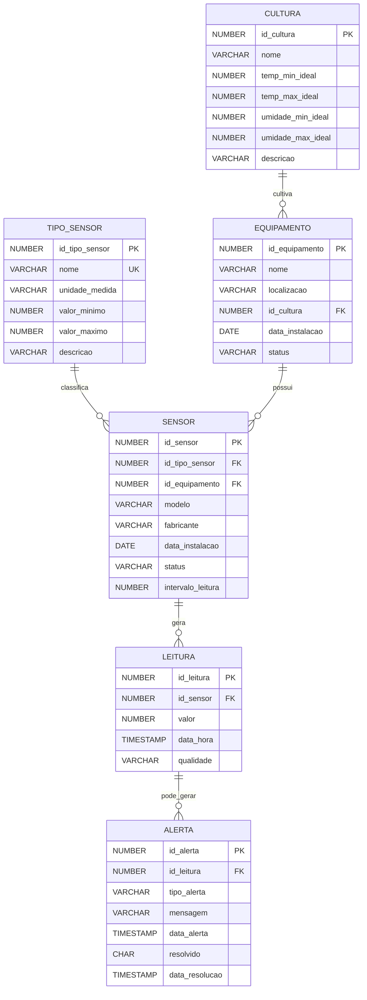

# Documentação do Banco de Dados - FarmTech Solutions

## 📊 Diagrama Entidade-Relacionamento (DER)



## 📋 Descrição das Entidades

### 1. **TIPO_SENSOR**
**Finalidade:** Armazenar os diferentes tipos de sensores disponíveis no sistema.

| Campo | Tipo | Descrição | Restrições |
|-------|------|-----------|------------|
| id_tipo_sensor | NUMBER | Identificador único do tipo de sensor | PK, AUTO_INCREMENT |
| nome | VARCHAR2(50) | Nome do tipo de sensor | NOT NULL, UNIQUE |
| unidade_medida | VARCHAR2(20) | Unidade de medida do sensor | NOT NULL |
| valor_minimo | NUMBER(10,2) | Valor mínimo esperado | NULLABLE |
| valor_maximo | NUMBER(10,2) | Valor máximo esperado | NULLABLE |
| descricao | VARCHAR2(200) | Descrição detalhada do tipo | NULLABLE |

**Justificativa:** Centraliza as configurações de cada tipo de sensor, permitindo validação de valores e padronização.

### 2. **CULTURA**
**Finalidade:** Registrar os tipos de culturas cultivadas e seus parâmetros ideais.

| Campo | Tipo | Descrição | Restrições |
|-------|------|-----------|------------|
| id_cultura | NUMBER | Identificador único da cultura | PK, AUTO_INCREMENT |
| nome | VARCHAR2(100) | Nome da cultura | NOT NULL |
| temp_min_ideal | NUMBER(5,2) | Temperatura mínima ideal (°C) | NULLABLE |
| temp_max_ideal | NUMBER(5,2) | Temperatura máxima ideal (°C) | NULLABLE |
| umidade_min_ideal | NUMBER(5,2) | Umidade mínima ideal (%) | NULLABLE |
| umidade_max_ideal | NUMBER(5,2) | Umidade máxima ideal (%) | NULLABLE |
| descricao | VARCHAR2(500) | Descrição e observações | NULLABLE |

**Justificativa:** Permite configurar parâmetros ideais por cultura, essencial para algoritmos de ML e alertas automáticos.

### 3. **EQUIPAMENTO**
**Finalidade:** Gerenciar as estufas e outros equipamentos de cultivo.

| Campo | Tipo | Descrição | Restrições |
|-------|------|-----------|------------|
| id_equipamento | NUMBER | Identificador único | PK, AUTO_INCREMENT |
| nome | VARCHAR2(100) | Nome do equipamento | NOT NULL |
| localizacao | VARCHAR2(100) | Localização física | NULLABLE |
| id_cultura | NUMBER | Cultura cultivada | FK → CULTURA |
| data_instalacao | DATE | Data de instalação | DEFAULT SYSDATE |
| status | VARCHAR2(20) | Status operacional | CHECK IN ('Ativo', 'Inativo', 'Manutenção') |

**Justificativa:** Organiza os equipamentos por localização e cultura, facilitando o gerenciamento e manutenção.

### 4. **SENSOR**
**Finalidade:** Registrar cada sensor físico instalado nos equipamentos.

| Campo | Tipo | Descrição | Restrições |
|-------|------|-----------|------------|
| id_sensor | NUMBER | Identificador único | PK, AUTO_INCREMENT |
| id_tipo_sensor | NUMBER | Tipo do sensor | FK → TIPO_SENSOR, NOT NULL |
| id_equipamento | NUMBER | Equipamento onde está instalado | FK → EQUIPAMENTO |
| modelo | VARCHAR2(50) | Modelo do sensor | NULLABLE |
| fabricante | VARCHAR2(50) | Fabricante | NULLABLE |
| data_instalacao | DATE | Data de instalação | DEFAULT SYSDATE |
| status | VARCHAR2(20) | Status do sensor | CHECK IN ('Ativo', 'Inativo', 'Manutenção') |
| intervalo_leitura | NUMBER | Intervalo entre leituras (segundos) | DEFAULT 60 |

**Justificativa:** Permite rastreabilidade completa de cada sensor, incluindo manutenções e substituições.

### 5. **LEITURA**
**Finalidade:** Armazenar todas as leituras coletadas pelos sensores.

| Campo | Tipo | Descrição | Restrições |
|-------|------|-----------|------------|
| id_leitura | NUMBER | Identificador único | PK, AUTO_INCREMENT |
| id_sensor | NUMBER | Sensor que gerou a leitura | FK → SENSOR, NOT NULL |
| valor | NUMBER(10,2) | Valor medido | NOT NULL, CHECK (-100 ≤ valor ≤ 200) |
| data_hora | TIMESTAMP | Momento da leitura | DEFAULT CURRENT_TIMESTAMP |
| qualidade | VARCHAR2(20) | Classificação da leitura | CHECK IN ('Normal', 'Alerta', 'Crítico') |

**Justificativa:** Tabela principal para análise de dados históricos e treinamento de modelos ML.

### 6. **ALERTA**
**Finalidade:** Registrar alertas gerados por leituras anormais.

| Campo | Tipo | Descrição | Restrições |
|-------|------|-----------|------------|
| id_alerta | NUMBER | Identificador único | PK, AUTO_INCREMENT |
| id_leitura | NUMBER | Leitura que gerou o alerta | FK → LEITURA, NOT NULL |
| tipo_alerta | VARCHAR2(50) | Tipo do alerta | NOT NULL |
| mensagem | VARCHAR2(500) | Descrição do alerta | NULLABLE |
| data_alerta | TIMESTAMP | Momento do alerta | DEFAULT CURRENT_TIMESTAMP |
| resolvido | CHAR(1) | Status de resolução | CHECK IN ('S', 'N'), DEFAULT 'N' |
| data_resolucao | TIMESTAMP | Quando foi resolvido | NULLABLE |

**Justificativa:** Permite rastreamento de problemas e análise de padrões de falhas.

## 🔗 Relacionamentos

### Cardinalidades:
- **TIPO_SENSOR → SENSOR**: 1:N (Um tipo pode ter vários sensores)
- **CULTURA → EQUIPAMENTO**: 1:N (Uma cultura pode estar em vários equipamentos)
- **EQUIPAMENTO → SENSOR**: 1:N (Um equipamento pode ter vários sensores)
- **SENSOR → LEITURA**: 1:N (Um sensor gera várias leituras)
- **LEITURA → ALERTA**: 1:N (Uma leitura pode gerar vários alertas)

## 🚀 Índices de Performance

```sql
CREATE INDEX idx_leitura_sensor ON Leitura(id_sensor);
CREATE INDEX idx_leitura_data ON Leitura(data_hora);
CREATE INDEX idx_sensor_tipo ON Sensor(id_tipo_sensor);
CREATE INDEX idx_sensor_equip ON Sensor(id_equipamento);
CREATE INDEX idx_alerta_leitura ON Alerta(id_leitura);
```

**Justificativa dos Índices:**
- `idx_leitura_sensor`: Acelera consultas de leituras por sensor específico
- `idx_leitura_data`: Otimiza consultas por período de tempo
- `idx_sensor_tipo`: Melhora joins entre sensores e tipos
- `idx_sensor_equip`: Acelera consultas de sensores por equipamento
- `idx_alerta_leitura`: Otimiza consultas de alertas por leitura

## 🔒 Restrições de Integridade

1. **Chaves Primárias:** Todas as tabelas possuem identificadores únicos auto-incrementados
2. **Chaves Estrangeiras:** Garantem integridade referencial entre as tabelas
3. **Constraints CHECK:** Validam valores de status e faixas de valores
4. **NOT NULL:** Campos obrigatórios definidos conforme necessidade do negócio
5. **UNIQUE:** Campo `nome` em TIPO_SENSOR para evitar duplicações

## 📈 Previsão de Integração Futura

### Ferramentas de Visualização:
- **Grafana**: Para dashboards em tempo real das leituras
- **Power BI**: Para análises históricas e relatórios gerenciais
- **Tableau**: Para visualizações avançadas e descoberta de padrões

### APIs e Integrações:
- **REST API**: Para consulta e inserção de dados via aplicações web/mobile
- **MQTT Broker**: Para recebimento de dados IoT em tempo real
- **Apache Kafka**: Para processamento de streams de dados

### Machine Learning:
- **Python/Scikit-learn**: Para modelos preditivos de manutenção
- **TensorFlow**: Para detecção de anomalias complexas
- **Apache Spark**: Para processamento de big data

## 🎯 Benefícios da Modelagem

1. **Escalabilidade**: Estrutura preparada para crescimento de dados
2. **Flexibilidade**: Fácil adição de novos tipos de sensores e culturas
3. **Performance**: Índices otimizados para consultas frequentes
4. **Integridade**: Constraints garantem qualidade dos dados
5. **Manutenibilidade**: Estrutura clara e bem documentada
6. **Análise ML**: Dados estruturados prontos para algoritmos de Machine Learning