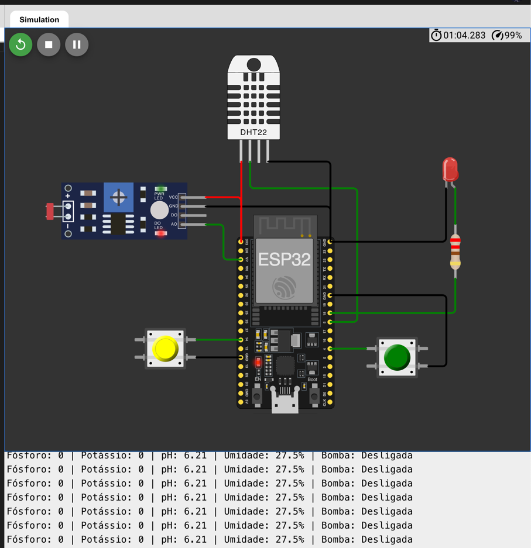

# FIAP - Faculdade de Informática e Administração Paulista

## 📌 Nome do projeto
**FarmTech Solutions — Sistema de Irrigação Inteligente com Monitoramento de Nutrientes e Ambiente**

## Nome do Grupo

FarmTech Solutions

## 👨‍🎓 Integrantes:
- Italo Domingues – RM: 561787
- Maison Wendrel Bezerra Ramos – RM: 565616
- Jocasta de Kacia Bortolacci – RM: 564730

## 👩‍🏫 Professores:

**Tutor(a):**  
Lucas Gomes Moreira

**Coordenador(a):**  
André Godoi Chiovato

---

## 📜 Descrição

### Entrega 1: Circuito de Simulação

A automação de sistemas agrícolas é uma necessidade crescente no setor agroindustrial, visando maior eficiência no uso de recursos hídricos e nutrientes. O **FarmTech Solutions** é um projeto baseado em **ESP32** que simula um sistema de irrigação inteligente, capaz de monitorar:

- Presença de nutrientes essenciais (Fósforo e Potássio);
- Simulação de pH do solo utilizando um sensor LDR;
- Nível de umidade relativa do ar com sensor DHT22.

O sistema **aciona automaticamente uma bomba de irrigação** (simulada com um LED) quando três condições são simultaneamente atendidas:

1. Presença de pelo menos um nutriente.
2. pH dentro da faixa ideal (5.5 a 7.5).
3. Umidade abaixo de 40%.

Este projeto demonstra a aplicação de microcontroladores em sistemas agrícolas para otimizar processos de irrigação, reduzir o desperdício de água e melhorar a produtividade.



### Entrega 2: Modelo Entidade-Relacionamento e Operações CRUD

Para a segunda entrega do projeto, desenvolvemos um Modelo Entidade-Relacionamento (MER) que representa a estrutura de dados necessária para o funcionamento completo do sistema FarmTech Solutions.


#### Operações CRUD Implementadas

Nossa implementação inclui um sistema completo de gerenciamento de dados com operações CRUD (Create, Read, Update, Delete) para todas as entidades principais, dividida em três módulos principais:

**1. Gerenciamento de Plantações**
- **Cadastro**: Registro de novas áreas de cultivo com nome, localização e data de plantio
- **Listagem**: Visualização de todas as plantações cadastradas no sistema
- **Busca**: Localização de plantações específicas por ID
- **Edição**: Atualização de informações das plantações existentes
- **Exclusão**: Remoção de plantações do sistema

**2. Gerenciamento de Sensores**
- **Cadastro**: Adição de novos sensores associados a plantações específicas
- **Listagem**: Visualização de todos os sensores ou filtrados por plantação
- **Busca**: Localização de sensores específicos por ID
- **Edição**: Atualização de configurações e informações dos sensores
- **Exclusão**: Remoção de sensores inativos ou defeituosos

**3. Gerenciamento de Dados dos Sensores**
- **Registro**: Armazenamento de novas leituras com data, hora e valores
- **Consulta**: Visualização do histórico de leituras com filtros por sensor ou plantação
- **Atualização**: Correção de leituras incorretas ou anômalas
- **Remoção**: Exclusão de dados inválidos ou não mais necessários

#### Dados de Exemplo e Carga Inicial

Para facilitar os testes e demonstrações, criamos o arquivo `seeds.sql` com dados iniciais para o sistema. Este script insere uma plantação de exemplo, cinco sensores associados à plantação, e dados de leituras para cada sensor baseados nas informações extraídas do arquivo `log_esp32.txt` da entrega anterior. As leituras representam um dia de operação do sistema, mostrando como a bomba de irrigação é acionada automaticamente quando todas as condições necessárias são atendidas.

O sistema utiliza um banco de dados PostgreSQL para armazenar todas as informações, com uma estrutura relacional que conecta plantações, sensores e suas leituras, permitindo rastreabilidade completa e análise temporal dos dados coletados.

---

## 🔧 Como executar o projeto

### ✅ Pré-requisitos

#### Para o Circuito (Entrega 1):
- ESP32 DevKit
- Sensor DHT22
- Módulo LDR
- 2 Botões (push buttons)
- LED e resistor
- Jumpers e protoboard
- IDE Arduino instalada
- Biblioteca `DHT.h` instalada

#### Para o Sistema de Dados (Entrega 2):
- Python 3.8 ou superior
- PostgreSQL
- Docker e Docker Compose (opcional, para execução em container)

### 🚀 Passo a passo

#### Para o Circuito:
1. Monte o circuito conforme o diagrama fornecido.
2. Faça o upload do código `farmtech_solutions.ino` para o ESP32 utilizando a IDE Arduino.
3. Abra o **Monitor Serial** na IDE, configurado a **115200 bps**, para visualizar os dados de sensores e o estado da bomba.
4. Interaja com os botões para simular a presença de nutrientes e varie a luminosidade do LDR para simular diferentes níveis de pH.
5. Observe o acionamento automático do LED conforme as condições são atendidas.

#### Para o Sistema de Dados:
1. Clone este repositório.
2. Configure o PostgreSQL ou use Docker com o comando:
   ```
   cd entrega_2
   docker-compose up -d
   ```
3. Execute o script SQL para criar as tabelas:
   ```
   psql -h localhost -U postgres -d postgres -f entrega_2/sql.sql
   ```
4. Opcionalmente, carregue os dados de exemplo:
   ```
   psql -h localhost -U postgres -d postgres -f entrega_2/seeds.sql
   ```
5. Execute a aplicação:
   ```
   cd entrega_2
   python main.py
   ```
6. Utilize o sistema de menus para navegar entre as operações de gerenciamento de plantações, sensores e dados.

---

## 🗃 Histórico de lançamentos

| Versão | Data       | Descrição                                                                                           |
|--------|------------|-----------------------------------------------------------------------------------------------------|
| 1.0    | 20/05/2025 | Implementação do circuito de simulação com ESP32 e Implementação do banco de dados e operações CRUD |

---

## 📋 Licença

MODELO GIT FIAP por FIAP está licenciado sob a licença [Attribution 4.0 International](https://creativecommons.org/licenses/by/4.0/).