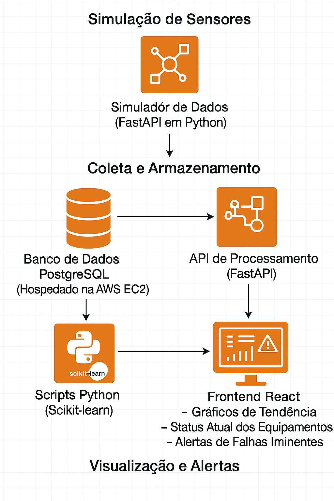

# FIAP - Faculdade de Informática e Administração Paulista

 

# Plataforma de Manutenção Preditiva com IA

## Solução de IA e IoT

## 👨‍🎓 Integrantes: 

- Italo Domingues – RM: 561787
- Maison Wendrel Bezerra Ramos – RM: 565616
- Felipe Cristovao da Silva – RM: 564288
- Jocasta de Kacia Bortolacci – RM: 564730

### 👨‍🏫 Professores:

**Tutor(a)**: Lucas Gomes Moreira  
**Coordenador(a)**: André Godoi Chiovato

## 1. Descrição

Este projeto tem como objetivo desenvolver uma proposta de solução inteligente baseada em Inteligência Artificial (IA) para manutenção preditiva em ambientes industriais. A solução foca na redução de falhas operacionais e aumento da eficiência de três tipos de equipamentos: máquinas de solda, prensas excêntricas e pontes rolantes. O sistema utilizará dados coletados por sensores físicos ou simulados para prever falhas e gerar recomendações preventivas, automatizando a tomada de decisão e contribuindo com a excelência operacional.

## 2. Equipamentos Monitorados

A proposta contempla o monitoramento preditivo de três equipamentos industriais estratégicos:

### 2.1 Máquina de Solda de Componentes Bypass
- Sensores: Temperatura dos eletrodos, Corrente elétrica, Ciclos por minuto.
- Objetivo: Detectar sobrecarga elétrica e desgaste dos eletrodos.

### 2.2 Prensas Excêntricas
- Sensores: Vibração nos mancais, Força por ciclo, Frequência de acionamento.
- Objetivo: Identificar desalinhamentos e desgaste estrutural.

### 2.3 Ponte Rolante
- Sensores: Carga aplicada, Velocidade de deslocamento, Temperatura do motor.
- Objetivo: Monitorar sobrecarga e falhas de tração.

## 3. Solução Proposta

A solução proposta consiste em uma plataforma de manutenção preditiva baseada em IA, capaz de monitorar os equipamentos em tempo real, identificar anomalias operacionais e gerar recomendações inteligentes de manutenção preventiva.

As principais funcionalidades da plataforma incluem:

- **Coleta automatizada de dados** por meio de sensores físicos (como ESP32) ou simulação em ambiente controlado.
- **Análise preditiva com modelos de machine learning**, utilizando dados históricos e em tempo real.
- **Detecção de padrões de falha** e anomalias de funcionamento nos equipamentos monitorados.
- **Geração de alertas automáticos**, relatórios e dashboards individualizados por equipamento.
- **Interface amigável para visualização**, permitindo o acompanhamento da saúde dos ativos e suporte à tomada de decisão.
- **Execução local ou em nuvem (AWS)**, garantindo flexibilidade de testes e escalabilidade futura.

## 4. Tecnologias Utilizadas

### 4.1 Linguagens e Bibliotecas
- Python, Pandas, NumPy, Scikit-learn

### 4.2 Simulação de Sensores
- FastAPI em Python com dados em tempo real

### 4.3 Armazenamento de Dados
- PostgreSQL na AWS EC2

### 4.4 Visualização
- React.js com dashboards e alertas

### 4.5 Infraestrutura
- Hospedagem em EC2 (AWS)

## 5. Pipeline de Dados

### 5.1 Fluxo

### 1. Simulação de Sensores
- Um **Simulador de Dados**, desenvolvido em **Python com FastAPI**, é responsável por gerar dados em tempo real simulando sensores industriais.
- Os dados simulados incluem informações como:
  - `timestamp`
  - `id do equipamento`
  - `variáveis medidas` (ex: temperatura, vibração, carga).

### 2. Coleta e Armazenamento
- Os dados gerados pelo simulador são enviados diretamente para:
  - Um **banco de dados PostgreSQL**, hospedado em uma **instância EC2 da AWS**.
- Esse banco armazena o histórico completo de leituras, permitindo análises temporais futuras.
- Paralelamente, os dados também são disponibilizados para uma **API de Processamento**, que poderá fazer uso direto deles para alimentar os módulos de análise ou outras funcionalidades.

### 3. Processamento e Análise Preditiva
- **Scripts em Python**, utilizando a biblioteca **Scikit-learn**, acessam o banco de dados periodicamente.
- Esses scripts aplicam **modelos de machine learning** que:
  - Detectam **padrões anômalos**
  - Identificam **tendências perigosas**
  - Preveem **possíveis falhas futuras** com base no histórico de dados dos sensores.

### 4. Visualização e Alertas
- O resultado da análise é disponibilizado por meio de um **frontend em React**, que consome a **API de processamento**.
- A interface apresenta:
  - **Gráficos de tendência**
  - **Status atual dos equipamentos monitorados**
  - **Alertas visuais de falhas iminentes** detectadas pelos modelos.

### 5.2 Diagrama

A arquitetura completa da pipeline representada graficamente:

## 6. Plano de Desenvolvimento e Responsabilidades

A equipe é composta por quatro integrantes, cada um com responsabilidades bem definidas para garantir a organização e entrega do projeto de forma eficiente:

| Integrante | Responsabilidade Principal                           |
|------------|--------------------------------------------------------|
| **Felipe** | Pipeline de dados e simulação dos sensores             |
| **Maison** | Desenvolvimento dos modelos de IA e validação          |
| **Italo**  | Front-end e visualização dos dados com React           |
| **Jocasta**| Documentação da proposta e integração geral do sistema |

## 📋 Licença

<a property="dct:title" rel="cc:attributionURL" href="https://github.com/agodoi/templa...